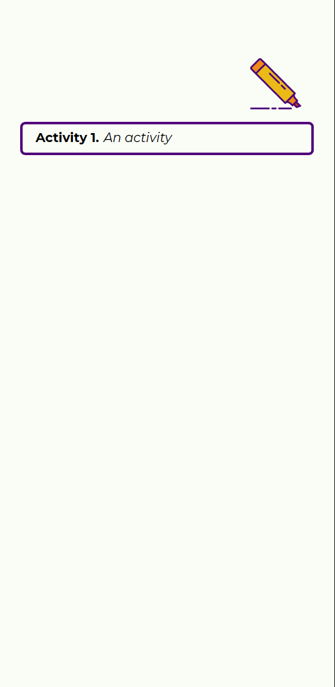
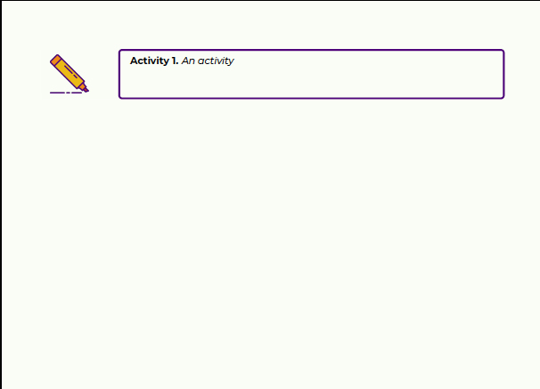

# LaTeX Class - screendoc
## Description
This class is designed to produce usable documents for viewing on a pc/tablet screen or on a phone screen. It is not intended that you print documents prepared by this class. There are two options: `screen` and `phone`. 

The icons used are made by **prettyicons** available at [www.flaticon.com](www.flaticon.com)

# Installing
You will need a working version of **LuaLatex** and the **Montserrat** font which can be found and installed from [Google Fonts](https://fonts.google.com/).

To install this class file simply clone it into your local repository, then run the database filename refresh:
- On Mac or Linux open a terminal and type ```sudo texhash```
- On Windows use the TeXLive Manager for TeXLive installations (under the Action menu) or if you have MiKTeX go to the MiKTeX Admin app, go to the Options and click on the Refresh FNDB button

## Disclaimer
I wrote this in a day - it's probably very buggy and certainly not perfect. But it works. I also spent some time looking at good practice for choosing fonts and colouring these things but I'm no expert.

## Theorem style environments
The class comes with the following environments for creating theorems etc. They are numbered consecutively and we use the package ```tcolorbox```. Use them as normal, for example:

    \begin{thm}
        ...
    \end{thm}

The environments are 
- Lemma: `lem`
- Proposition: `prop` 
- Theorem: `thm`
- Corollary: `cor`

## Activities and examples
The intention is to have activities and examples with external links to solutions, be that movie clips, dynamic content or static solution sheets. There are two environments `activity` and `example` that provide this. Each has an optional argument that should be a URL to an external source. For example

    \begin{activity}[http://www.youtube.com]
        An activity
    \end{activity}

Produces the following in phone mode and screen mode respectively. The icon is clickable.

 

We use coloured icons to represent an active link and monochrome icons to represent inactive links - if the optional link above is not present then the icon used is


## The `withlink` command
I have also provided a `withlink` command that takes two parameters: ```\withlink{<content>}{<URL>}```

As with the `example` and `activity` environments this is meant to link written content with online content.

## Conditional page breaks
Sometimes, especially in phone mode, the page breaks can lead to poor readability. The commands
```
\breakifphone
\breakifscreen
```
offer conditional breaking. 

## Conditional environments
We have provided two environments, ``onscreen`` and ``onphone`` that are rendered only in ``screen`` or in ``phone`` mode respectively. 

## Adding images
To add images we recommend using the [`adjustbox`](https://ctan.org/pkg/adjustbox?lang=en) package, then using its `max size` option. For example:

```
\usepackage[export]{adjustbox}

\begin{document}
\includegraphics[max size = {.9\textwidth}{.9\textheight}]{images/myimage.jpg}
\end{document}
```